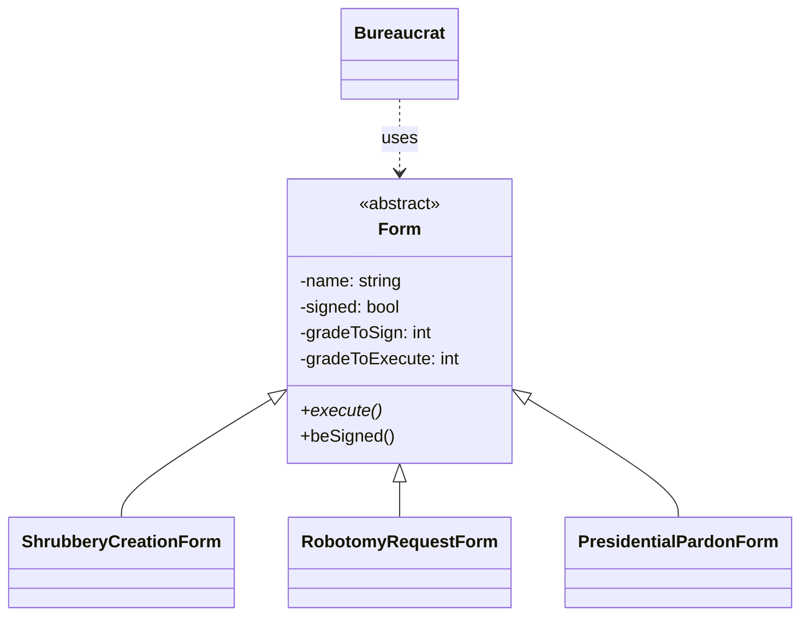

<div align="center">
  <h1>💻 CPP Module 05</h1>
  <p>예외 처리 | 관료제 시뮬레이션</p>

  
  
  <div>
    
    
  </div>

  ### 학습 내용
  - try-catch 예외 처리 메커니즘
  - 사용자 정의 예외 클래스 구현
  - 예외 클래스 상속 구조
  - 스택 풀기(Stack Unwinding)
  - RAII 패턴과 예외 안전성
</div>

## 🚀 Quick Start
```bash
make && ./bureaucrat
```

## 📋 목차
1. [개요](#-개요)
2. [구현 요구사항](#-구현-요구사항)
3. [클래스 설계](#-클래스-설계)
4. [예외 처리](#-예외-처리)
5. [테스트 방법](#-테스트-방법)

## 🎯 개요
> C++ 예외 처리와 관료제 시스템을 구현하는 프로젝트입니다.

### 프로젝트 구조
```
📦 CPP-Module-05
 ├── 📜 Bureaucrat.{hpp,cpp}        # 관료 클래스
 ├── 📜 Form.{hpp,cpp}              # 추상 폼 클래스
 ├── 📜 ShrubberyCreationForm       # 나무 생성 폼
 ├── 📜 RobotomyRequestForm         # 로봇화 요청 폼
 ├── 📜 PresidentialPardonForm      # 대통령 사면 폼
 └── 📜 main.cpp                    # 테스트 코드
```

### Key Features
- 관료(Bureaucrat) 등급 관리 (1~150)
- 나무 생성, 로봇화, 대통령 사면 문서(Form) 처리
- 예외 처리
- RAII 패턴 적용

## 💡 구현 요구사항
> 모든 클래스는 Orthodox Canonical Form을 준수해야 합니다.

### 필수 구현
- [x] Orthodox Canonical Form
  - 기본 생성자
  - 복사 생성자
  - 대입 연산자
  - 소멸자
- [x] 사용자 정의 예외 클래스
- [x] Form 상속 구조
- [x] RAII 패턴 적용

## 📊 클래스 설계
> 추상 Form 클래스를 상속받는 세 가지 구체적인 Form 클래스를 구현합니다.

### 클래스 다이어그램


### Form 등급 요구사항
| Form 종류 | 서명 등급 | 실행 등급 |
|-----------|-----------|-----------|
| Shrubbery | 145 | 137 |
| Robotomy | 72 | 45 |
| Presidential | 25 | 5 |

### 핵심 구현 코드
#### Form 클래스
```cpp
class Form {
private:
    const std::string _name;
    bool _signed;
    const int _gradeToSign;
    const int _gradeToExecute;

public:
    virtual void execute(const Bureaucrat&) const = 0;
    void beSigned(const Bureaucrat& bureaucrat);
    
    // Exceptions
    class GradeTooHighException;
    class GradeTooLowException;
    class NotSignedException;
};
```

## 🔧 예외 처리
> std::exception을 상속받아 사용자 정의 예외를 구현합니다.

### 예외 클래스 구조
```cpp
// 1. Bureaucrat 예외
class GradeTooHighException : public std::exception {
    virtual const char* what() const throw() {
        return "Error: Grade too high (min: 1)";
    }
};

class GradeTooLowException : public std::exception {
    virtual const char* what() const throw() {
        return "Error: Grade too low (max: 150)";
    }
};

// 2. Form 예외
class NotSignedException : public std::exception {
    virtual const char* what() const throw() {
        return "Error: Form not signed";
    }
};
```

### RAII(Resource Acquisition Is Initialization) 패턴 적용
```cpp
// 파일 자동 닫기를 보장하는 RAII 클래스
class FileGuard {
    std::ofstream& _ofs;
public:
    FileGuard(std::ofstream& ofs) : _ofs(ofs) {}
    ~FileGuard() { 
        if (_ofs.is_open()) 
            _ofs.close(); 
    }
};

// 사용 예시
void ShrubberyCreationForm::execute(const Bureaucrat& executor) const {
    std::ofstream ofs(_target + "_shrubbery");
    FileGuard guard(ofs);  // 스코프 종료 시 자동으로 파일 닫힘
    
    // ... 파일 작성 ...
}
```

## 🔍 테스트 방법
> 다양한 시나리오에 대한 테스트를 진행합니다.

### 기본 테스트
```cpp
int main() {
    try {
        // 1. 기본 생성 테스트
        Bureaucrat boss("Boss", 1);        // 최고 등급
        Bureaucrat intern("Intern", 150);  // 최저 등급

        // 2. Form 생성 및 서명 테스트
        ShrubberyCreationForm shrub("home");
        boss.signForm(shrub);              // 성공
        shrub.execute(boss);               // 파일 생성

        // 3. 권한 부족 테스트
        PresidentialPardonForm pardon("criminal");
        intern.signForm(pardon);           // 실패: 등급 부족
    }
    catch (const std::exception& e) {
        std::cerr << e.what() << std::endl;
    }
}
```

### 테스트 시나리오
| 테스트 케이스 | 예상 결과 | 확인 |
|--------------|-----------|------|
| 잘못된 등급으로 관료 생성 | 예외 발생 | ✓ |
| 권한 없는 Form 서명 시도 | 예외 발생 | ✓ |
| 미서명 Form 실행 시도 | 예외 발생 | ✓ |
| 정상적인 Form 실행 | 성공 | ✓ |

### 메모리 누수 테스트
```bash
# valgrind로 메모리 누수 체크
valgrind --leak-check=full ./bureaucrat
```

## ⚠️ 주의사항
> 구현 시 반드시 확인해야 할 사항들입니다.

### 필수 확인사항
- Form은 추상 클래스로 구현
  ```cpp
  class Form {
      // ... 멤버 변수들 ...
  public:
      virtual void execute(const Bureaucrat&) const = 0;  // 순수 가상 함수
  };
  ```
- 모든 예외는 std::exception 상속
  ```cpp
  class GradeTooHighException : public std::exception {
      virtual const char* what() const throw();  // noexcept
  };
  ```
- RAII 패턴으로 리소스 관리
  ```cpp
  void someFunction() {
      std::ofstream ofs("file.txt");
      FileGuard guard(ofs);  // 자동 리소스 정리
      // ... 작업 수행 ...
  }  // 스코프 종료 시 자동으로 파일 닫힘
  ```

## 💡 Tips
### 디버깅
- valgrind 사용법
  ```bash
  valgrind --leak-check=full --show-leak-kinds=all ./bureaucrat
  ```
- gdb 활용
  ```bash
  gdb ./bureaucrat
  (gdb) break main
  (gdb) run
  ```

### 코드 품질
- const 정확성 확보
- 명확한 네이밍
- 일관된 코딩 스타일
- 적절한 주석 처리

## ✅ 평가 준비

### 1. 기본 요구사항
| 항목 | 설명 | 확인 |
|-----|------|------|
| Orthodox Canonical Form | 모든 클래스가 OCF 준수 | ⬜ |
| 예외 처리 | std::exception 상속, what() 구현 | ⬜ |
| Form 구현 | 추상 클래스, 가상 소멸자 | ⬜ |
| RAII | 리소스 자동 정리 | ⬜ |

### 2. Form 별 요구사항
```cpp
// 각 Form의 등급 요구사항과 특징
ShrubberyCreationForm
    - Sign: 145, Exec: 137
    - ASCII 트리 파일 생성

RobotomyRequestForm
    - Sign: 72, Exec: 45
    - 50% 성공률의 로봇화

PresidentialPardonForm
    - Sign: 25, Exec: 5
    - Zaphod Beeblebrox의 사면
```

### 3. 체크리스트
- [ ] 모든 클래스 OCF 구현 확인
- [ ] 예외 처리 동작 테스트
- [ ] 메모리 누수 검사
- [ ] 파일 처리 확인
- [ ] const 정확성 검증
- [ ] 코드 스타일 점검

## 📚 참고자료

### C++ 관련
- [C++ Reference](https://en.cppreference.com/)
  - [Exception Handling](https://en.cppreference.com/w/cpp/language/exceptions)
  - [RAII](https://en.cppreference.com/w/cpp/language/raii)
  - [Virtual Functions](https://en.cppreference.com/w/cpp/language/virtual)

### 디자인 패턴
- [RAII Pattern](https://en.cppreference.com/w/cpp/language/raii)
- [Factory Pattern](https://refactoring.guru/design-patterns/factory-method)

### 도구
- [Valgrind Guide](https://valgrind.org/docs/manual/quick-start.html)
- [GDB Tutorial](https://www.gnu.org/software/gdb/documentation/)

### 예외 처리
```cpp
// 1. 기본 예외 처리
try {
    // 위험한 작업
} catch (const std::exception& e) {
    // 예외 처리
}

// 2. 중첩 예외 처리
try {
    // 외부 작업
    try {
        // 내부 작업
    } catch (...) {
        // 내부 예외 처리
    }
} catch (const std::exception& e) {
    // 외부 예외 처리
}
```